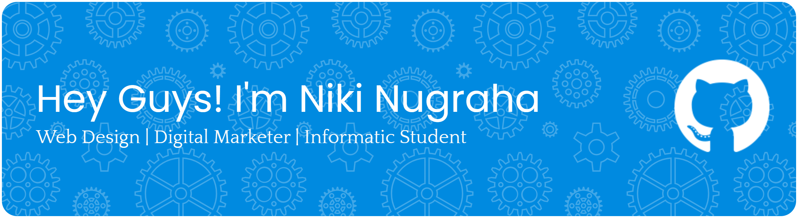

  

<h3 align="center">
  "1% Better Everyday"
</h3>

  
  ---
  
  👋 **About Me**
  
  Saya adalah **Pelajar**  yang memiliki passion di persimpangan antara **Teknologi** dan **Kreativitas**. Saya tidak hanya menulis kode, tetapi juga memastikan produk tersebut enak dipandang dan memiliki strategi pasar yang jelas.

---

### 🚀 Keahlian Utama (The Tri-Force)

|             🎨 **Web Design & UI/UX**             |               💻 **Informatics & Dev**               |            📈 **Digital Marketing**             |
| :-----------------------------------------------: | :--------------------------------------------------: | :---------------------------------------------: |
| Menciptakan pengalaman visual yang user-friendly. | Memahami algoritma dan struktur data di balik layar. | Menganalisis data dan mengoptimalkan jangkauan. |

 

### 🛠️ Tech & Tools Stack

**Design & Creative**

  
  
  
  
  

**Development (Informatics)**

  
  
  
  
  
  
  
  
  

**Marketing & Analytics**

  
  
  

 

### 📫 Let's Connect!

  
  
  

